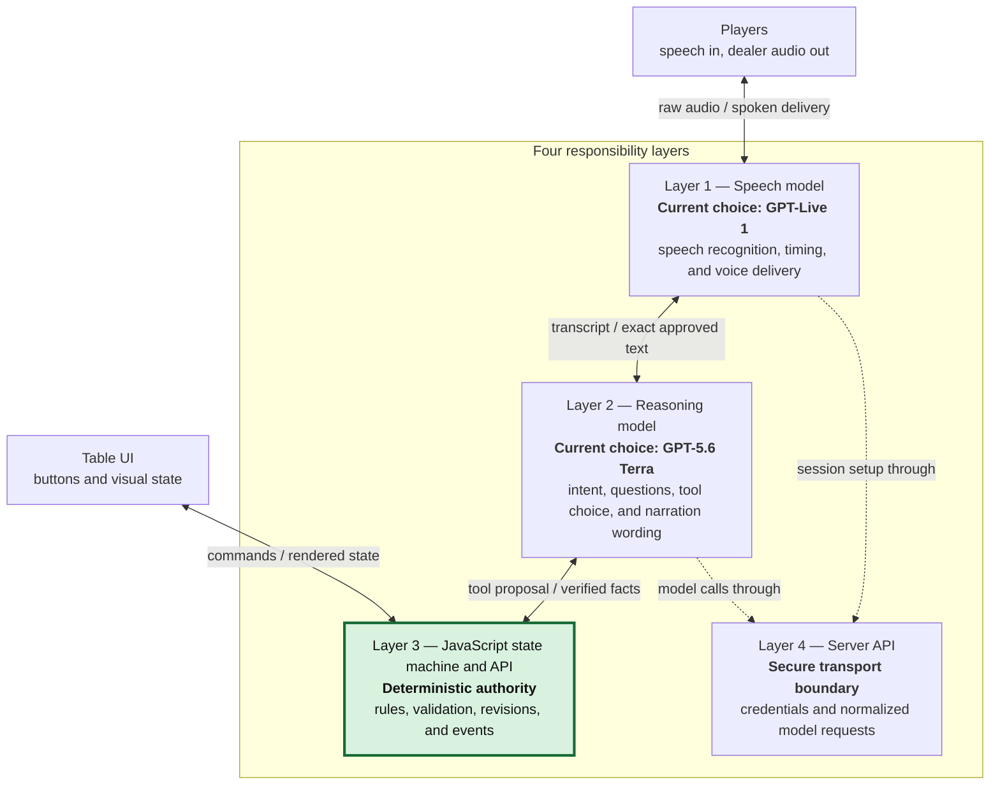
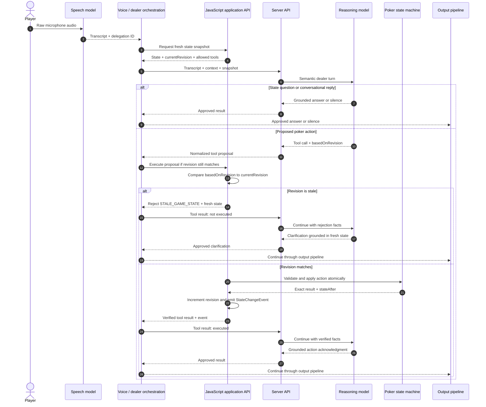
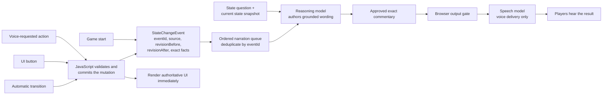

# RoboDeal model-layering design

## Status and audience

This document explains the architecture of RoboDeal Classic's voice dealer and
the reasons behind it. It is written for someone learning how to build AI
systems: the important lesson is not the particular model names, but how to put
probabilistic models around a deterministic application without giving up
correctness.

This document uses role names throughout:

- **speech model** for realtime speech input and output;
- **reasoning model** for language understanding and response composition; and
- **state machine** for authoritative poker rules and state transitions.

GPT-Live 1 and GPT-5.6 Terra are the current choices for the speech and
reasoning roles. They can be replaced without changing the responsibilities of
the roles.

The document describes both the current separation of responsibilities and one
required concurrency hardening: state revisions. The current source serializes
reasoning turns, but it does not yet attach and validate a monotonic state
revision on every AI-requested mutation. That gap is called out explicitly
below.

## Goals

### G1. Keep the rules correct

Poker is a deterministic rule system. For a given valid state and action, the
next state is defined: whose turn it is, whether a raise is legal, how many
chips move, and which street comes next are not matters of interpretation.

A language model can be impressive and still be wrong occasionally. Speech
adds another source of uncertainty. Therefore, a model must never be the
authority for poker state or rules. Deterministic code must validate and apply
every transition.

### G2. Understand how people actually speak

Mapping human language onto a precise game action is subtle. “Too rich for me,
I'm out” means fold; a standalone “check” from the current player may be a
commitment; “Sam, you need to say ‘check’” is coaching or quotation and must
not execute a check.

This is where a strong reasoning model is valuable. It can use syntax,
conversation history, current-player context, quotation, address, and poker
idiom to infer intent. Deterministic code should not try to reproduce this
open-ended language judgment with a pile of regular expressions.

### G3. Understand and produce speech well

Recognizing speech in a noisy room, detecting utterance boundaries, supporting
interruptions, and producing responsive natural audio are specialist problems.
A high-quality realtime speech model should handle them.

Audio competence is not poker competence. The speech model does not get to
answer poker questions or invent what happened in the game. It transcribes
input and speaks text approved by the reasoning layer.

### G4. Never act on stale game state

Models take time. During that time a player can press a button and advance the
game independently. An AI action inferred from an earlier snapshot must never
be applied to the newer state merely because it happens to still resemble a
valid action.

Every AI mutation request therefore needs an optimistic-concurrency token: the
state revision it was based on. JavaScript must atomically compare that token
with the current revision before validating and applying the action. A mismatch
is a stale request, not an invitation to reinterpret the old command.

### G5. Narrate every real state change

The table UI can always move the game without speech. Automatic transitions can
also occur. Players who are not looking at the screen still need to hear what
happened, so narration cannot be merely a direct response to voice input.

Every successful authoritative state change emits a structured event. Narration
is generated from that event, whether the change began with speech, a button,
or the game engine. The initial game announcement is treated the same way: a
verified game-start event supplies the rules and setup facts to narrate.

### G6. Keep boundaries narrow, inspectable, and replaceable

Each layer should have one kind of authority, exchange structured information
at its boundaries, and be replaceable without moving responsibilities into the
wrong layer. This makes failures easier to contain and the architecture easier
to test, audit, and adapt to future models.

## Architectural stack

This is a responsibility stack, not a literal network diagram. The two message
flow diagrams below show the direction of individual requests.



The green layer is the trust boundary: it alone decides what actually happened
in the game. Intelligence increases the quality of interpretation around that
boundary; it does not replace the boundary.

## Layer responsibilities and how they advance the goals

### Layer 1 — Speech model

The speech model is the only model that receives microphone audio and produces
spoken audio. The current implementation uses GPT-Live 1. This layer:

- maintains the low-latency WebRTC audio session;
- turns foreground speech into native transcript deltas;
- detects when an utterance may require client delegation;
- forwards transcript and delegation events to the browser;
- converts application-approved commentary into natural speech; and
- handles spoken cadence, accent, pace, and interruption.

The speech model does not decide poker rules, execute moves, answer questions
from its own understanding of the table, or invent game narration. It may vary
delivery and prosody, but not the factual content of approved text. While the
reasoning model or JavaScript is working, it stays silent; the browser's visual
processing state acknowledges the delay.

The browser keeps speech output muted by default. It opens the output gate only
after approved commentary is supplied and closes it after the final
output-audio event and local playback drain.

**Why this choice:** It advances G3 by assigning hard realtime audio work to an
audio specialist, and G6 by preventing that specialist from acquiring semantic
or game authority.

### Layer 2 — Reasoning model

The reasoning model is the semantic dealer. The current implementation uses
GPT-5.6 Terra. It receives an envelope containing:

- the source event, such as a voice transcript or verified state-change event;
- a snapshot of authoritative game state and its revision;
- recent conversation needed to interpret short utterances and corrections;
  and
- the tools that JavaScript currently permits it to request.

The reasoning model:

- distinguishes a committed declaration from a question, coaching, quotation,
  hypothetical, or background discussion;
- resolves natural and creative poker phrasing into an exposed tool request;
- answers questions about the current player, pot, stacks, legal actions, and
  next required step from supplied state;
- explains rejected actions using the returned legal state; and
- writes concise, varied dealer narration grounded in verified event facts.

It cannot mutate game state directly. A tool call is a proposal, never evidence
that a move occurred. It must wait for JavaScript's result before describing a
proposed mutation as fact.

**Why this choice:** It advances G2 by concentrating nuanced language judgment
in the strongest language model, G5 by giving narration organic phrasing, and
G1 by withholding authority from that model.

### Layer 3 — JavaScript state machine and application API

The state machine in `game-state.js`:

- stores players, stacks, contributions, blinds, dealer, current player,
  betting round, pots, and hand phase;
- computes available actions and legal wager bounds;
- validates every transition;
- moves chips and advances turns and streets; and
- resolves deterministic outcomes.

The application API in `app.js`:

- exposes only supported actions;
- accepts action requests, not model-authored replacement state;
- compares each AI request's `basedOnRevision` with the current revision;
- atomically validates, executes, and increments the revision;
- returns structured success or failure facts plus authoritative state; and
- emits a `StateChangeEvent` after every successful transition, regardless of
  whether its source was voice, UI, or automation.

The orchestration code serializes reasoning-model turns, supplies fresh
snapshots and tool schemas, returns tool results to the same reasoning turn,
and admits only validated structured speech to the output path.

**Why this choice:** It directly provides G1. Revision checks provide G4;
serialization alone cannot, because UI actions do not wait for a model turn.
State-change events provide G5 without coupling narration to any one input
method.

### Layer 4 — Server API

The server routes are intentionally thin:

- `POST /api/live-session` creates the speech-model WebRTC session and returns
  the SDP answer.
- `POST /api/dealer-turn` sends a reasoning-model request and returns
  normalized tool calls or a validated structured dealer result.

The server holds the OpenAI API key. It does not own poker state and does not
decide whether a move is legal.

**Why this choice:** It advances G6 by isolating credentials and vendor-specific
transport while leaving game authority in a locally testable domain layer.

## Input message processing

An incoming utterance passes through perception, interpretation, and
deterministic validation. These are deliberately separate decisions.



The crucial lesson is that the reasoning model may be correct about what the
player meant and still be too late to act. Semantic confidence cannot substitute
for a revision check. A stale request must be rejected and reconsidered against
fresh state; JavaScript must not silently retarget it to a different turn.

For a valid action, the resulting `StateChangeEvent`—not the old transcript—is
the authoritative source for narration.

## Output message processing

Answers and narration share a controlled speech path, but they have different
factual origins. A question answer is grounded in a current state snapshot.
Narration is grounded in a completed state-change event.



This advances G5 because every mutation source converges on the same event
path. A button press cannot bypass narration merely because there was no
transcript. The UI need not wait for narration to render the committed state;
audio follows asynchronously from immutable event facts.

Events should have stable IDs so retries cannot narrate one transition twice.
Narration failure must never roll back a committed poker action. The system may
retry or surface an audio error, but the state remains authoritative.

The opening announcement is a game-start event containing facts such as game
type, ante or blinds, players, dealer position, and first required action. The
reasoning model turns those facts into a natural introduction; it does not
invent the setup.

## Concurrency and event contracts

### State revision contract

To satisfy G4, every state-changing entry point must obey the same rules:

1. Each committed game state has a monotonically increasing revision.
2. A snapshot given to the reasoning model includes that revision.
3. A mutation proposal returns it as `basedOnRevision`.
4. JavaScript compares it with the current revision immediately before
   execution.
5. Comparison, validation, mutation, and revision increment occur as one
   indivisible application operation.
6. A mismatch produces `STALE_GAME_STATE`, changes nothing, and returns fresh
   legal state for a new decision.

Queuing reasoning-model turns remains useful: it prevents two AI continuations
from racing each other. It is not a substitute for revisions because buttons
and automatic transitions can modify state outside that queue.

### State-change event contract

A successful mutation emits one immutable event with, at minimum:

```text
eventId
source: voice | ui | automatic | game-start
revisionBefore
revisionAfter
actionFacts
stateSummaryAfter
```

Narration consumes this event. It does not reconstruct facts from the user's
words, DOM state, or model memory. This makes narration input-independent and
auditable.

## Intended guarantees

### Deterministic guarantees

When all state-changing entry points implement the contracts above:

- only JavaScript owns and changes poker state;
- every move is checked by the state machine;
- a model cannot author replacement state;
- an AI action cannot apply after its source snapshot becomes stale;
- successful transitions emit exactly one narratable event;
- mutation narration is based on postcondition facts, not predictions;
- the API key remains on the server; and
- browser playback opens only for application-approved commentary.

### Probabilistic behaviors

Prompts, schemas, validation, and evaluation can improve these behaviors but
cannot make them mathematical guarantees:

- the speech model transcribes noisy speech accurately;
- the reasoning model distinguishes declarations from coaching, quotations,
  questions, and table chatter;
- the reasoning model asks for clarification only when ambiguity is material;
- the reasoning model varies dealer style without changing names, actions,
  amounts, or outcomes; and
- the speech model preserves approved content while varying vocal delivery.

The architecture is designed so an occasional model mistake becomes a rejected
proposal or awkward sentence, not corrupted game state.

## Explicit non-guarantees

- The system does not identify physical speakers. Textual and table context can
  support an actor inference, but cannot prove who spoke.
- Transcription and semantic interpretation can produce false positives or
  false negatives and need evaluation with real table conversations.
- The architecture does not guarantee zero latency. A state-changing voice turn
  includes turn detection, transcription, reasoning-model tool selection,
  revision validation, state execution, narration, and speech startup.
- The output gate controls what is audible locally; a model event alone does
  not prove that every buffered audio frame reached the speakers.

## Failure behavior

- An illegal proposal is rejected without changing state; the reasoning model
  may explain the currently valid options.
- A stale proposal is rejected without changing state and reconsidered only
  from a fresh snapshot.
- If the reasoning model or server fails, the game remains usable through the
  UI.
- If narration fails after a committed mutation, state stays committed and the
  event can be retried or marked failed.
- If an utterance is unrelated, the reasoning model returns structured silence.
- If unexpected speech-model output occurs, the output gate remains closed.
- After reconnection, models receive current JavaScript state rather than
  reconstructing it from conversation memory.

## Design tradeoffs

The principal tradeoff is latency versus authority. Letting a model announce
and apply its prediction immediately would feel faster, but could speak or
execute an action that never legally happened. RoboDeal chooses the verified
sequence and exposes processing state in the UI while the models work.

The second tradeoff is architectural ceremony. Revisions, structured events,
tool results, queues, and output gates add code. They are justified because
they turn fuzzy model behavior into bounded proposals and make independent UI,
voice, and automatic control paths converge on one authoritative system.

## Lessons to reuse in future AI systems

When designing another AI-assisted application, ask:

1. **What must never be guessed?** Put it in deterministic code with explicit
   invariants.
2. **What requires open-ended judgment?** Give that narrow task to the strongest
   appropriate reasoning model.
3. **Does the medium need a specialist?** Speech, vision, and other realtime
   inputs may deserve their own perception/presentation layer.
4. **Can the world change while a model thinks?** Carry a revision or
   precondition and reject stale proposals at the authority boundary.
5. **What should trigger output?** For facts about completed work, react to
   authoritative state-change events, not merely to the input that requested
   them.
6. **What happens when a model is wrong or unavailable?** The core application
   should stay valid and, where possible, remain usable.

This pattern is broadly useful: let models perceive, interpret, and communicate;
let deterministic software authorize and commit.

## Current implementation note

The source already separates the speech model, reasoning model, JavaScript
state authority, and server transport; it serializes reasoning turns and gates
audio output.

The monotonic `stateRevision` / `basedOnRevision` check and a unified durable
`StateChangeEvent` path are requirements of this design, but are not fully
implemented in the current source. Until they are, turn serialization reduces
races but does not provide the full stale-state guarantee described by G4.

## Source map

- `Prompts.json`: speech- and reasoning-model role instructions, tool
  descriptions, and structured response schema.
- `voice-agent.js`: speech-model WebRTC transport, transcripts, delegation,
  and output gate.
- `dealer-agent.js`: serialized reasoning-model tool loop.
- `app.js`: state snapshots, voice tools, UI events, and tool execution.
- `game-state.js`: authoritative poker transition engine.
- `openai-api.js`: OpenAI request construction and response normalization.
- `api/live-session.js`: server route for speech-model session creation.
- `api/dealer-turn.js`: server route for reasoning-model turns.

## Reference

The terms “client delegation,” “thinking append,” and “commentary append” follow
OpenAI's [Delegation and tools in GPT-Live](https://developers.openai.com/api/docs/guides/live-delegation)
documentation.
