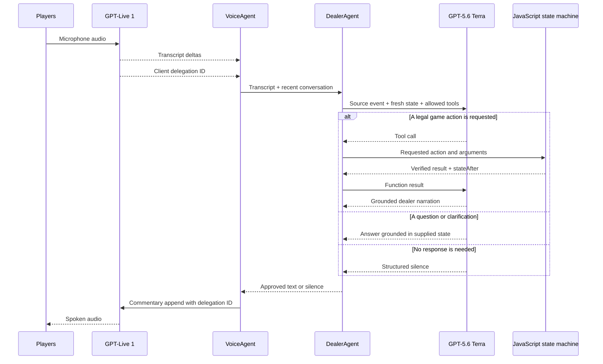

# RoboDeal model-layering design

## Status

This document describes the model and application boundaries used by RoboDeal
Classic's voice dealer. It records the intended architecture and the invariants
that future changes should preserve.

## Goals

RoboDeal should feel like a natural spoken poker dealer while keeping game
state deterministic and auditable. Players should be able to use ordinary
poker-table language, ask questions about the game, and hear varied narration.
No language model is allowed to become the authority on whose turn it is,
which actions are legal, how many chips move, or what state follows an action.

The design separates four concerns:

1. GPT-Live 1 handles the live audio conversation.
2. GPT-5.6 Terra interprets language, selects application actions, answers
   questions, and authors dealer narration.
3. Browser JavaScript owns game state and executes all poker transitions.
4. Server API routes keep the OpenAI credential off the client and relay model
   requests.

## Components and responsibilities

### GPT-Live 1: audio edge

GPT-Live is the only model that receives microphone audio and produces spoken
audio. It:

- maintains the low-latency WebRTC audio session;
- turns foreground speech into native transcript deltas;
- detects when an utterance may require client delegation;
- forwards transcript and delegation events to the browser;
- converts Terra-approved commentary into natural speech; and
- handles spoken cadence, accent, pace, and interruption.

GPT-Live does not decide poker rules, execute moves, answer questions from its
own understanding of the table, or invent game narration. While Terra or
JavaScript is working, it stays silent. The browser's visual processing state
is the acknowledgment to the player.

The browser keeps GPT-Live's output muted by default. It opens the output gate
only after the application has supplied approved commentary and closes it after
the final output-audio event plus a locally observed playback drain. This gate
is a second enforcement layer in addition to the live-model prompt.

### GPT-5.6 Terra: language and dealer judgment

Terra is the semantic dealer. It receives a fresh envelope containing:

- the source event, such as a voice transcript or verified UI event;
- a snapshot of the authoritative game state; and
- recent user/dealer conversation needed to interpret short utterances and
  corrections.

Terra:

- distinguishes a committed poker declaration from a question, coaching,
  quotation, hypothetical, or background discussion;
- resolves natural and creative poker phrasing into one of the exposed tools;
- answers questions about the current player, pot, stacks, legal actions, and
  next required step from the supplied state snapshot;
- requests an application tool when a game mutation is intended;
- waits for the JavaScript result before describing a mutation;
- explains rejected actions using the returned legal state; and
- writes concise, varied dealer narration grounded in verified facts.

Terra cannot mutate game state directly. Tool names and arguments express a
request, not a completed action. A Terra tool call is never evidence that the
move occurred.

### Browser JavaScript: authoritative application

Browser JavaScript is the sole authority for the poker game.

The state machine in `game-state.js`:

- stores players, stacks, contributions, blinds, dealer, current player,
  betting round, pots, and hand phase;
- computes available actions and legal wager bounds;
- validates every transition;
- moves chips and advances turns and streets;
- resolves deterministic outcomes; and
- returns a new state rather than accepting a model-authored state.

The application controller in `app.js`:

- exposes only the supported voice tools;
- maps each tool call onto state-machine operations;
- returns a raw structured result containing success or failure, exact action
  facts, and the authoritative state after execution;
- creates fresh state snapshots for Terra and GPT-Live;
- sends verified UI transitions through Terra for narration; and
- updates the visible table from JavaScript state.

The `DealerAgent` orchestration layer:

- serializes turns so two utterances cannot race the state machine;
- sends the source event, state snapshot, recent conversation, and tool schema
  to Terra;
- executes at most one state-changing tool for an utterance;
- returns JavaScript tool output to the same Terra response; and
- accepts Terra's final structured speech result only after tool processing is
  complete.

The `VoiceAgent` transport layer:

- owns the GPT-Live WebRTC connection and event channel;
- accumulates native transcript fragments;
- associates a client-delegation ID with the relevant transcript;
- passes delegated work to `DealerAgent`;
- appends approved Terra text back to GPT-Live; and
- enforces the browser-side output gate.

### Server API: credential and transport boundary

The server routes are intentionally thin:

- `POST /api/live-session` creates the GPT-Live WebRTC session and returns the
  SDP answer.
- `POST /api/dealer-turn` sends a Terra Responses request and returns either
  normalized tool calls or a validated structured dealer result.

The server holds the OpenAI API key. It does not own poker state and does not
decide whether a move is legal. Authoritative state remains in the browser for
the current physical-table game.

## Message flow

### Voice action

1. GPT-Live produces transcript fragments and a client-delegation event.
2. `VoiceAgent` collects the fragments and invokes `DealerAgent`.
3. `DealerAgent` sends Terra the transcript and a state snapshot.
4. Terra requests one application tool.
5. JavaScript validates and executes the request.
6. JavaScript returns raw facts and `stateAfter`.
7. Terra authors narration using that verified result.
8. `VoiceAgent` opens the output gate and asks GPT-Live to speak the approved
   text.

This action path deliberately includes a Terra continuation after JavaScript.
That adds latency, but it lets narration describe the outcome rather than the
model's prediction of the outcome.

### State question

1. The transcript and current state are sent to Terra.
2. Terra answers from the supplied snapshot without calling a mutation tool.
3. GPT-Live speaks the approved answer.

Questions therefore require no state transition and normally only one Terra
response.

### UI or automatic state transition

1. JavaScript executes or observes a verified application transition.
2. The application sends Terra a structured event containing the before/after
   facts needed for narration.
3. Terra writes the dealer line without repeating the action through a tool.
4. GPT-Live speaks that line.

The opening game announcement follows this path. JavaScript supplies the table
configuration and immediate deal instruction; Terra turns those facts into a
natural introduction.

## Intended guarantees

### Hard application guarantees

- **Single source of truth:** Only JavaScript owns and changes game state.
- **Legal transitions:** Every requested move is checked by the state machine.
- **No model-authored state:** Models may request actions but cannot submit the
  resulting state.
- **Postcondition-grounded narration:** A mutating action is narrated only
  after JavaScript returns its result.
- **Serialized mutation:** Delegated turns are queued, preventing concurrent
  model responses from racing state transitions.
- **Credential isolation:** The OpenAI API key remains on the server.
- **Speech allowlisting:** Browser playback is normally closed and opens only
  for application-approved commentary.

### Prompt- and model-level guarantees

These are design constraints enforced by prompts, schemas, and validation, but
they remain probabilistic model behavior:

- GPT-Live should remain silent while the backend is working.
- GPT-Live should preserve Terra's factual content rather than adding claims.
- Terra should distinguish declarations from coaching, quotations, questions,
  and table chatter.
- Terra should ask for clarification when actor, commitment, action, or amount
  remains genuinely ambiguous.
- Terra should vary style without changing verified names, actions, amounts, or
  outcomes.

Structured response validation and the output gate reduce the consequences of
violations, but they do not make semantic interpretation infallible.

## Explicit non-guarantees

- The system does not identify physical speakers. GPT-Live supplies transcript
  content, not verified player identity.
- Transcription can be wrong or incomplete.
- Textual context can support an actor inference, but it cannot prove who spoke.
- Natural-language intent classification can produce false positives or false
  negatives and must be evaluated with real table conversations.
- The architecture does not guarantee zero latency. A state-changing voice turn
  includes turn detection, transcript collection, a Terra tool-selection
  response, JavaScript execution, a Terra narration continuation, and GPT-Live
  speech startup.
- The browser output gate controls what is audible locally; a model event alone
  does not prove that the user's speakers played every buffered audio frame.

## Failure behavior

- If Terra requests an illegal action, JavaScript rejects it without changing
  state and Terra explains the useful valid options.
- If Terra or the server fails, the state is unchanged and the UI reports the
  error; GPT-Live receives no invented success narration.
- If an utterance is unrelated, Terra returns structured silence.
- If unexpected GPT-Live output occurs without approved commentary, the output
  gate remains closed.
- If the browser reconnects, current JavaScript state is resupplied rather than
  reconstructed from model memory.

## Design tradeoffs

The principal tradeoff is latency versus authority. Allowing a model to both
infer and announce a transition before JavaScript validates it would be faster,
but could speak an action that never legally happened. RoboDeal chooses the
slower verified sequence.

Client delegation also gives the browser explicit control over state snapshots,
tool execution, result validation, and audible output. A future move to hosted
Responses delegation may reduce connection and request overhead, but it must
preserve the same state-machine authority, post-result narration, turn
serialization, and output-gating invariants.

## Source map

- `Prompts.json`: GPT-Live and Terra role instructions, tool descriptions, and
  Terra's structured response schema.
- `voice-agent.js`: GPT-Live WebRTC transport, transcripts, delegation, and
  output gate.
- `dealer-agent.js`: serialized Terra tool loop.
- `app.js`: state snapshots, voice tools, UI events, and tool execution.
- `game-state.js`: authoritative poker transition engine.
- `openai-api.js`: OpenAI request construction and response normalization.
- `api/live-session.js`: server route for GPT-Live session creation.
- `api/dealer-turn.js`: server route for Terra turns.

## Reference

The terms “client delegation,” “thinking append,” and “commentary append” follow
OpenAI's [Delegation and tools in GPT-Live](https://developers.openai.com/api/docs/guides/live-delegation)
documentation.
